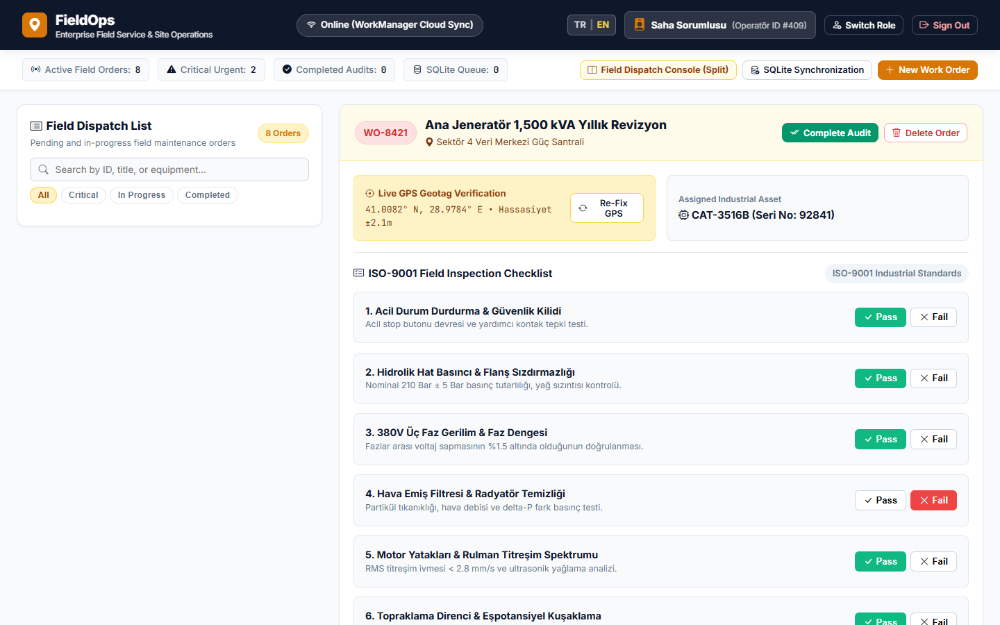
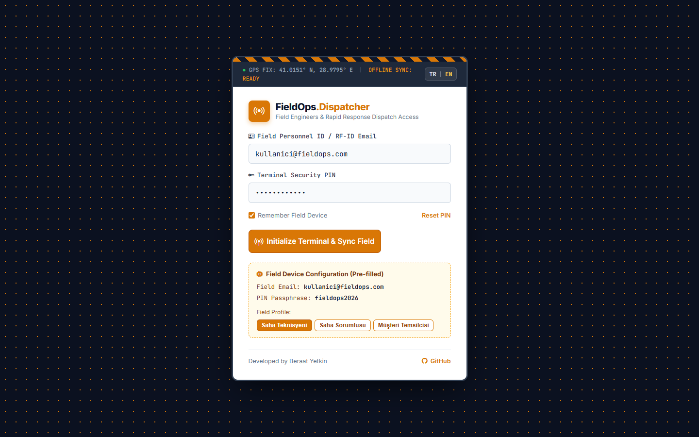

# FieldOps
> Enterprise Field Service Dispatcher & Mobile Inspection Terminal

[](https://fieldopsapp.web.app)
[](LICENSE)
[](https://developer.mozilla.org)
[](https://developer.mozilla.org)
[](https://fieldopsapp.web.app)

---

## Previews

### 1. Two-Column Dispatcher Console (Split-Screen)
Filterable work orders list on the left, live GPS coordinates, ISO-9001 inspection criteria, and work order deletion on the right:


### 2. Industrial Dispatcher Terminal Login Portal
High-visibility hazard stripes, real-time GPS telemetry ribbon, RF-ID/technician credentials, and role selector:


---

## Key Features

### Industrial Dispatcher Architecture
- Split-Screen Workstation:
  - Left Column: Searchable, urgency-filtered work order queue (Critical, In Progress, Completed).
  - Right Column: In-depth order inspection studio with live GPS geolocation, ISO-9001 checklist verification, and technician digital signature canvas.
- Telemetry & Offline Queue: Status ribbon displaying GPS lock state and offline synchronization queue buffer.

### Safe Work Order Deletion Mechanism
- Prominent Delete Order action button located in the order studio header next to inspection completion.
- Confirmation modal with order ID safeguarding against accidental removals.
- Reactive metric recalculation: deleted items are removed from DOM and localStorage, automatically updating active, critical, and queued order counters.

### Session Persistence & Zero-Flicker Initialization
- Persists authentication state across browser refreshes via localStorage.
- Instant inline check prevents login screen flicker on page reload.
- Secure sign-out action clears credentials and returns to the dispatcher login portal.
- Pre-filled credentials with instant role switches (Field Supervisor, Technician / User, Client).

### Bilingual Support (English | Turkish)
- In-place language switching for all order statuses, technical checklist criteria, modal dialogs, and alerts.
- Default language is English.

---

## Tech Stack

| Layer | Technology | Role |
| :--- | :--- | :--- |
| UI & Layout | HTML5, CSS3 Grid, Flexbox | Industrial amber and slate carbon split console |
| Business Logic | Vanilla JavaScript (ES6+) | Reactive order filtering, checklist state, signature pad |
| Icons | Bootstrap Icons v1.11.3 | System and industrial icons |
| Storage | HTML5 localStorage | Work orders, session state, language preferences |
| Hosting | Firebase Hosting | High-availability global deployment |

---

## Directory Structure

```
FieldOps/
├── index.html              # Complete single-page application
├── docs/                   # Documentation assets and screenshots
│   ├── preview-dashboard.png # High-resolution console preview
│   └── preview-login.png     # High-resolution login portal preview
└── README.md               # Project documentation
```

---

## Getting Started

1. Clone the repository:
   ```bash
   git clone https://github.com/kubrvk/FieldOps.git
   cd FieldOps
   ```
2. Open `index.html` in your browser:
   ```bash
   start index.html
   ```
3. Alternatively, serve via any static HTTP server:
   ```bash
   npx serve .
   ```
4. Access `http://localhost:3000` in your browser.
   - To bypass login and view the console directly: `http://localhost:3000/?demo=1`

---

## Live System

- Live URL: [https://fieldopsapp.web.app](https://fieldopsapp.web.app)
- Direct Dashboard Link: [https://fieldopsapp.web.app/?demo=1](https://fieldopsapp.web.app/?demo=1)

---

## Author

Developed by Beraat Yetkin
- GitHub: [@kubrvk](https://github.com/kubrvk)
- Repository: [FieldOps](https://github.com/kubrvk/FieldOps)
- Portfolio: [Beraat Yetkin Portfolio](https://github.com/kubrvk/portfolio)
